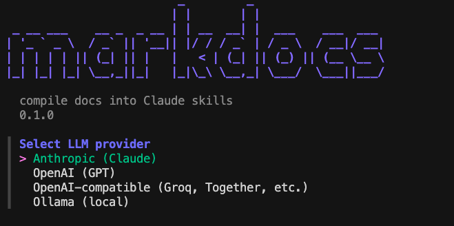

# markdocs



[](https://github.com/Nithin-Valiyaveedu/markdocs/actions/workflows/build.yml)
[](https://github.com/Nithin-Valiyaveedu/markdocs/actions/workflows/test.yml)
[](https://www.npmjs.com/package/@val-nithin/markdocs)
[](https://www.npmjs.com/package/@val-nithin/markdocs)
[](https://opensource.org/licenses/MIT)
[](https://goreportcard.com/report/github.com/Nithin-Valiyaveedu/markdocs)

CLI to compile library documentation into Claude Code skill files

## How It Works

`markdocs add react` does five things:

1. Asks the configured LLM for official documentation URLs
2. Lets you pick which URL(s) to scrape (interactive)
3. Scrapes the page with a built-in Go scraper (no external APIs)
4. Compiles the content into a structured skill file using the LLM
5. Writes `.claude/skills/frontend/react.md` — Claude Code picks it up next session

## Installation

1. Using `go`:

```bash
go install github.com/Nithin-Valiyaveedu/markdocs@latest
```

2. Using `npm`:

```bash
npm install -g @val-nithin/markdocs
```

3. Using `brew` (Mac/Linux):

```bash
brew tap Nithin-Valiyaveedu/markdocs
brew install markdocs
```

## Quick Start

```bash
# 1. Configure your LLM provider (runs once)
markdocs init

# 2. Add a skill for any library
markdocs add shadcn
markdocs add stripe
markdocs add drizzle-orm

# 3. Scan your project for missing skills
markdocs scan

# 4. Keep skills up to date
markdocs update --all
```

## Commands

### `markdocs init`

Interactively configure an LLM provider. Auto-detects from environment variables (`ANTHROPIC_API_KEY`, `OPENAI_API_KEY`) or a local Ollama instance.

Supported providers:
- **Anthropic** (Claude)
- **OpenAI** (GPT)
- **OpenAI-compatible** (Groq, Together AI, any custom endpoint via base URL)
- **Ollama** (local, auto-detected at `localhost:11434`)

Config is saved to `~/.markdocs/config.json`.

---

### `markdocs add <library>`

Find, scrape, compile, and write a skill file for the given library.

```bash
markdocs add react
markdocs add shadcn
markdocs add stripe --no-interactive
```

**Flags**

| Flag | Description |
|------|-------------|
| `--no-interactive` | Skip URL selection prompt, use first suggested URL |

The skill is written to `.claude/skills/<category>/<library>.md` in the current directory.

---

### `markdocs scan`

Detect libraries in the current project that don't have skill files yet. Reads `package.json`, `go.mod`, and `requirements.txt`.

```bash
markdocs scan
markdocs scan --add-all
```

**Flags**

| Flag | Description |
|------|-------------|
| `--add-all` | Automatically add skills for all missing libraries |

---

### `markdocs list`

Show all compiled skills for the current project.

```bash
markdocs list
markdocs list --stale
```

**Flags**

| Flag | Description |
|------|-------------|
| `--stale` | Show only skills compiled more than 7 days ago |

---

### `markdocs update [skill]`

Recompile skills whose source documentation has changed (detected via checksum comparison).

```bash
markdocs update react
markdocs update --all
```

**Flags**

| Flag | Description |
|------|-------------|
| `--all` | Check and update all skills |

## Skill File Format

Skills are plain Markdown with YAML frontmatter. All metadata is stored in the file itself — no database.

```markdown
---
name: react
category: frontend
sources:
  - https://react.dev/learn
compiled: 2026-04-12T10:23:00Z
checksum: sha256:abc123def456
model: llama3.2
provider: ollama
project_framework: next.js
markdocs_version: 0.1.0
---

# react — markdocs skill

## What This Is
## Installation (project-specific)
## Key Concepts
## API / Usage Patterns
## Your Project Config (detected)
## Hidden Gotchas
## Common Errors
## Version Notes
```

Skills are auto-categorised into `frontend`, `backend`, `testing`, `infra`, `database`, `payments`, `auth`, or `devtools`.

## Scraper

markdocs uses a built-in two-layer scraper — no external scraping APIs required:

- **Layer 1** — `net/http` + `go-readability` (works for most static doc sites)
- **Layer 2** — `go-rod` headless browser fallback (JS-rendered sites like Chakra UI, Radix)

Layer 2 requires Chrome or Chromium to be installed.

## Use as a Claude Code Skill

```bash
npx skills add Nithin-Valiyaveedu/markdocs
```

Or copy [`skills/markdocs/SKILL.md`](./skills/markdocs/SKILL.md) into your project's `.claude/skills/` directory.

## License

MIT
